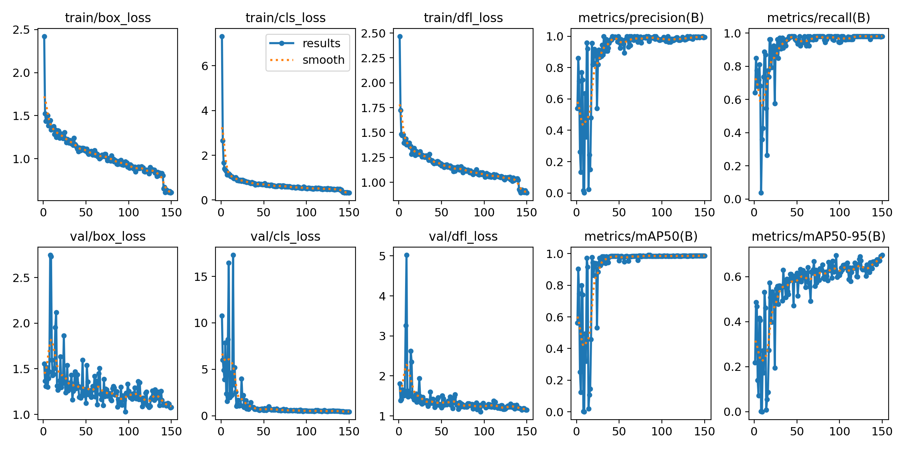
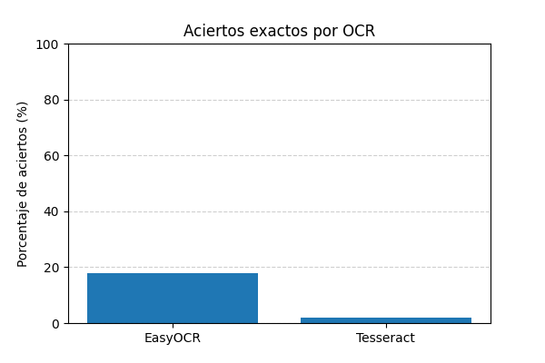
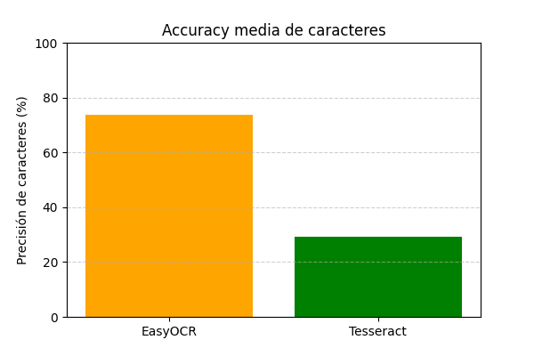
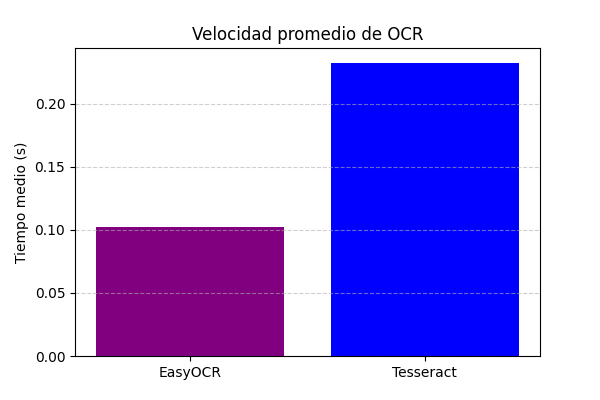

# Práctica 4 – Visión por Computador
## Lectura de matrículas de vehículos mediante OCR

Esta práctica consiste en la **lectura automática de matrículas de vehículos** utilizando técnicas de **detección de objetos (YOLO)** y **reconocimiento óptico de caracteres (OCR)**.

---

## 1. Entrenamiento de yolo

En primer lugar, he empleado un modelo **YOLO** preentrenado para detectar **vehículos y personas**.  
Posteriormente, realicé un **fine-tuning** sobre el modelo **YOLOv11s** con el objetivo de detectar específicamente las **matrículas** presentes en los vehículos detectados.

Para ello:

- Capturé **260 imágenes de matrículas** reales.  
- Las **etiqueté manualmente** utilizando la herramienta **LabelMe**.

El modelo fue entrenado con el siguiente comando:

```bash
yolo detect train data=dataset.yaml model=yolo11s.pt epochs=150 imgsz=640 batch=16 device=0 degrees=10 translate=0.1 scale=0.2 shear=0.05 perspective=0.0 flipud=0.0 fliplr=0.5 mosaic=True mixup=True
```

A continuación, se explica brevemente el significado de los principales parámetros:

- `data=dataset.yaml` → archivo de configuración con las rutas del dataset.  
- `model=yolo11s.pt` → modelo base utilizado para el entrenamiento.  
- `epochs=150` → número de épocas de entrenamiento.  
- `imgsz=640` → tamaño de las imágenes de entrada.  
- `batch=16` → tamaño del lote de entrenamiento.  
- `device=0` → GPU utilizada (en este caso, la primera).  
- `degrees`, `translate`, `scale`, `shear`, `perspective` → transformaciones de *data augmentation*.  
- `flipud` / `fliplr` → inversión vertical u horizontal de las imágenes.  
- `mosaic` / `mixup` → técnicas de *data augmentation* para combinar imágenes y mejorar la robustez del modelo.
---



---
El entrenamiento muestra una **mejora progresiva y estable** a lo largo de las 150 épocas, con una **reducción constante de las pérdidas** (losses) y un **incremento notable en las métricas de precisión y mAP**.

En las primeras épocas, las métricas presentaban mucha variabilidad y valores bajos, pero a partir de la época 30 aproximadamente, el modelo comienza a estabilizarse y mejorar de forma consistente hasta alcanzar un **rendimiento muy bueno a partir de la época 70**.

---
### Pérdida de Entrenamiento
- **Box Loss (train/box_loss)** pasó de ≈2.4 a ≈0.61, mostrando una reducción clara y continua.
- **Cls Loss (train/cls_loss)** disminuyó de ≈7.3 a ≈0.32, una mejora drástica.
- **Dfl Loss (train/dfl_loss)** bajó de ≈2.4 a ≈ 0.89, mostrando convergencia.

Las pérdidas de entrenamiento disminuyen de forma estable, sin indicios de sobreajuste temprano. Esto sugiere que el modelo está aprendiendo patrones relevantes de los datos.

### Pérdida de Validación
- Las pérdidas de validación siguieron un patrón similar al entrenamiento.
- A partir de la época 50, las pérdidas se estabilizan con valores bajos y consistentes.

El modelo **generaliza bien** sobre los datos de validación, sin un aumento repentino de las pérdidas (lo que indicaría overfitting).

---

### Métricas de Rendimiento

### 🔸 Precisión (metrics/precision(B))
- Aumentó desde **~0.54** hasta **~0.99**, mostrando una mejora clara.

### 🔸 Recall (metrics/recall(B))
- Subió de **~0.64** a **~0.98**, lo que indica una gran capacidad del modelo para detectar correctamente los objetos.

### 🔸 mAP50 (metrics/mAP50(B))
- Comenzó en **0.56** y alcanzó **≈0.98–0.99**, un buen rendimiento.

### 🔸 mAP50-95 (metrics/mAP50-95(B))
- Pasó de **~0.22** a **≈0.69**, indicando buena capacidad en distintos umbrales de IoU.

Las métricas reflejan un modelo **altamente preciso y robusto**, especialmente en mAP50, que supera el 98 %.  
El mAP50-95 también es elevado, señal de que el modelo tiene buen rendimiento incluso con criterios más estrictos.

---

### Tasa de Aprendizaje (lr)

- Los valores de `lr/pg0`, `lr/pg1` y `lr/pg2` disminuyen gradualmente de **0.00024** a **~0.0000332**, mostrando una correcta estrategia de reducción del learning rate.  
- Esta reducción progresiva contribuye a una convergencia más estable hacia el final del entrenamiento.

---


## 2. Procesamiento de vídeos

Una vez entrenado el modelo, se aplicó el detector a **dos vídeos grabados para este propósito**. Además el ocr utilizado ha sido easyocr puesto que ha sido el que mejor resultados ha dado según la comparativa realizada entre este y tesseract, la cual se detallará más adelante:

- El primero muestra los **vehículos por la parte delantera**.  
- El segundo, los **vehículos por la parte trasera**.

A continuación se incluyen los resultados visuales del modelo en ambos vídeos (GIFs):


Además los resultados del procesamiento se volcarón en dos archivos csv "detecciones_video_delante.csv" y "detecciones_video_delante.csv" guardando la siguiente información:

frame,tipo_objeto,confianza,tracking_id,x1,y1,x2,y2,matricula_conf,mx1,my1,mx2,my2,texto_matricula

---

### 3. Preservación del anonimato

Para proteger la identidad de las personas presentes en los vídeos, utilicé un modelo YOLO especializado en **detección de rostros**, disponible en el siguiente repositorio:  
[Yusepp/YOLOv8-Face](https://github.com/Yusepp/YOLOv8-Face)

Tras detectar las caras, apliqué un **efecto de pixelado** sobre ellas para garantizar el anonimato.

---
### 4. Comparativa OCR: EasyOCR vs Tesseract

Para el reconocimiento óptico de caracteres (OCR) en las matrículas, se probaron dos sistemas distintos:

- **EasyOCR**
- **Tesseract OCR**

Con el objetivo de comparar su rendimiento, se seleccionaron **50 imágenes aleatorias** del conjunto de datos y se evaluó el desempeño de ambos modelos.  
Para cada imagen se midió:
- Si el texto completo de la matrícula se reconocía **exactamente**.
- La **precisión carácter a carácter** (*character accuracy*).
- El **tiempo medio de ejecución** por imagen.

---

#### 4.1. Resultados de Exactitud Total



En este gráfico se muestran los **porcentajes de aciertos exactos**, es decir, el número de matrículas en las que el texto detectado coincidió completamente con el texto real (*ground truth*).

Los resultados evidencian una **ventaja clara de EasyOCR**, que logró una mayor proporción de coincidencias exactas respecto a Tesseract.  
Tesseract cometió errores frecuentes debido a caracteres adicionales o confusiones comunes (por ejemplo, letras por números), mientras que EasyOCR mantuvo un reconocimiento más estable.

---

#### 4.2. Precisión de Caracteres



La precisión por caracteres muestra el porcentaje de coincidencias entre los caracteres reconocidos y los reales.  
Aquí se observa nuevamente que **EasyOCR supera a Tesseract**, alcanzando una **precisión media más alta**.  
Aunque Tesseract logra reconocer parcialmente algunas matrículas, su rendimiento es inconsistente con placas más degradadas o con iluminación variable.

---

#### 4.3. Tiempos de Procesamiento



En términos de velocidad, **Tesseract fue ligeramente más rápido** en promedio.  
Sin embargo, la diferencia temporal entre ambos métodos es pequeña, y EasyOCR sigue siendo suficientemente rápido para un flujo de trabajo en tiempo real o semiautomático.

---

### 5. Archivos extras

El dataset y los vídeos utilizados en esta práctica se encuentran alojados en el siguiente enlace debido a su gran tamaño: [enlace a drive](https://drive.google.com/drive/folders/1QH7XDKuDlbvZdsLUQIi_tHcB7mLjjpVZ?usp=sharing)
